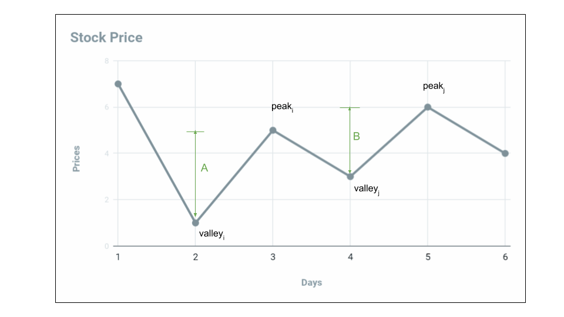

# Description

>Say you have an array for which the ith element is the price of a given stock on day i.
Design an algorithm to find the maximum profit. You may complete as many transactions as you like (i.e., buy one and sell one share of the stock multiple times).  
Note: You may not engage in multiple transactions at the same time (i.e., you must sell the stock before you buy again). 

Example 1:
```
Input: [7,1,5,3,6,4]
Output: 7
Explanation: Buy on day 2 (price = 1) and sell on day 3 (price = 5), profit = 5-1 = 4.
             Then buy on day 4 (price = 3) and sell on day 5 (price = 6), profit = 6-3 = 3.
```

Example 2:
```
Input: [1,2,3,4,5]
Output: 4
Explanation: Buy on day 1 (price = 1) and sell on day 5 (price = 5), profit = 5-1 = 4.
             Note that you cannot buy on day 1, buy on day 2 and sell them later, as you are
             engaging multiple transactions at the same time. You must sell before buying again.
```

Example 3:
```
Input: [7,6,4,3,1]
Output: 0
Explanation: In this case, no transaction is done, i.e. max profit = 0.
```

# Solution

### 1. Brute Force
此題若以暴力破解法解題，也就是根據每天的股價去計算出所有價差的可能的結果，再從結果中針對最大收利潤做加總。

#### Complexity Analysis:
- Time complexity : O(n!). Recursive function is called n^n times.
- Space complexity : O(n). Depth of recursion is n.

### 2. 動態規劃
根據題目描述，由於不限交易次數，所以只要買入價比賣出價低就有利可圖，根據以上條件，我們的目標就是找出所有符合上述條件的情況，最後將收益進行加總。
這裡延續121.題的思維: 
1. 首先在prices list長度小於2時，因為無法買賣，直接回傳0
2. 再來先定義 **buy = -prices[0]**、 **sell = buy + price** 買入與出售兩個狀態
3. 最後就是思考甚麼時候應該買入? 甚麼時候應該賣出?
先假設以第一天的股票價格做為買入初始值，若是第二天股價下跌，我們就將原本的買入價改成第二天的股票價格來降低買入成本(Line.47、48)，若第二天股價上漲，就賣出股票將收加到max_profit內(Line.50、51)，並將當天的股價當成第2次的買入成本，後面以此類推直到最後一天交易結束。

```py
class Solution:
    def maxProfit(self, prices: List[int]) -> int:
        if len(prices) < 2:
            return 0
        
        max_profit = 0
        buy = -prices[0]
        for price in prices:
            if -price > buy:
                buy = -price 
            sell = buy + price 
            if sell > 0:
                max_profit += sell
                buy = -price
        
        return max_profit
 ```
 
### Complexity Analysis
Time complexity : O(n). Single pass.  
Space complexity: O(1). Constant space needed.
  
### 3. Greedy

若我們將股票價格的陣列以圖形的方式畫出，可得到下圖
  

  
針對上圖進行分析可以發現，不論往後股價如何，只要今天的價格比昨天高，那麼昨天買進股票今天賣出就有利可圖，因此首先我們定義了max_profit來記錄股票買賣的獲利，再來只要判斷今天的股價是否有比昨天高，若有就把價差加入到max_profit中，如此循環到陣列結束即可。 由於不需要額外紀錄買入與賣出狀態，因此我們可以進一步將流程簡化如下。
  
  ```py
  class Solution:
    def maxProfit(self, prices: List[int]) -> int:
        max_profit = 0
        for i in range(1, len(prices)):
            if prices[i-1] < prices[i]:
                max_profit += (prices[i] - prices[i-1])           
            
        return max_profit
  ```
  
### Complexity Analysis
Time complexity : O(n). Single pass.  
Space complexity: O(1). Constant space needed.
