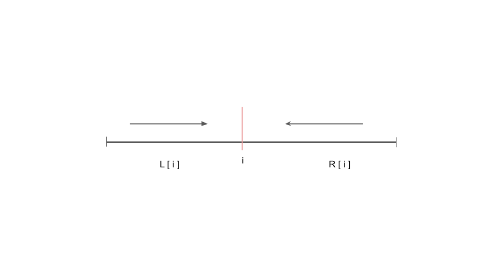

# Description

>Say you have an array for which the ith element is the price of a given stock on day i.
Design an algorithm to find the maximum profit. You may complete at most two transactions.  
Note: You may not engage in multiple transactions at the same time (i.e., you must sell the stock before you buy again).

Example 1:
```
Input: [3,3,5,0,0,3,1,4]
Output: 6
Explanation: Buy on day 4 (price = 0) and sell on day 6 (price = 3), profit = 3-0 = 3.
             Then buy on day 7 (price = 1) and sell on day 8 (price = 4), profit = 4-1 = 3.
```

Example 2:
```
Input: [1,2,3,4,5]
Output: 4
Explanation: Buy on day 1 (price = 1) and sell on day 5 (price = 5), profit = 5-1 = 4.
             Note that you cannot buy on day 1, buy on day 2 and sell them later, as you are
             engaging multiple transactions at the same time. You must sell before buying again.
```
Example 3:
```
Input: [7,6,4,3,1]
Output: 0
Explanation: In this case, no transaction is done, i.e. max profit = 0.
```

# Soluction

### 1. Brute Force

根據題目已知條件，我們知道在求取股票買賣最大利潤的過程中最多可以交易兩次，且在第一次買入股票後，賣出股票之前是不能進行第二次買入的。
前面在121.、122.題目中已經知道如何求取單次交易最大利潤，所以現在要思考的是如何切分第一次與第二次交易的時間點?
底下我們宣告了fstBuy、fstSell、secBuy、secSell(當作第一次與第二次的買入與賣出狀態)，針對prices陣列進行迭代，在迭代的過程中會不斷地去更新第一次的買入價格(fstBuy)以取得最低的買入成本，並把迭代當下的的價格(prices[i])當成賣出價來計算第一次交易的收益，然後以i為起始位置進行第二次迭代，在第二次迭代中只需要找到從i為起始到結束的最大收益即為該點(i)兩次交易的最大總收益。另外，由於第二次交易的起始是以i為基準點，所以在每次計算第二次交易的利潤時都需要重新初始化secBuy、secSell的值(故將其放在第一層for回圈內)。 最後ans紀錄每次交易總收益的最大值，全部完成迭代後返回ans即為解答。

此方法雖可求得正解，但在時間複雜度上較高，於Leetcode進行提交會跑出"Time Limit Exceeded"

```py
class Solution:
    def maxProfit(self, prices: List[int]) -> int:
        if len(prices) < 2:
            return 0
        
        fstSell = 0
        fstBuy = -prices[0]

        ans = 0
        for i in range(1, len(prices)):
            fstBuy = max(fstBuy, -prices[i])
            fstSell = max(fstSell, fstBuy + prices[i])

            secBuy = -prices[i]
            secSell = 0
            for j in range(i, len(prices)):
                secBuy = max(secBuy, -prices[j])
                secSell = max(secSell, secBuy + prices[j])
                ans = max(ans, fstSell + secSell)
        
        return ans
```

#### Complexity Analysis:
- Time complexity : O(n!). 
- Space complexity : O(1). 

### 2. 對於"兩次性"相關問題的解法

對於兩次性相關的問題通常可以使用以下解法，如下圖，以本題來說灰色線代表完整的prices list，由於我們最多會進行兩次交易，假設以紅色線做為區分點，將左右劃分出兩個區間，以本題來說因為股票交易區間沒有交疊，所以只需要各自找最佳解即可。



一開始我們以prices[0]當作第一次交易的買入初始值，並宣告l、r兩個陣列，l紀錄從左邊開始到切分點i的各點最佳值，r紀錄從右邊開始到切分點i的各頂最佳值，
兩個陣列預設初始值都是0(最低收益就是不做任何交易，所以初始值為0)，在分別計算完l、r個切分點的最佳值後，再來就是將l、r陣列合併計算最後兩次交易的結果，由於當切分值i=1時，左側最佳解位於l[1],而右側最佳解位於r[-2]，所以我們將r陣列翻轉後將l[i]、r[i]加總即為正解。

所以對於左側的l陣列來說，prices[0]第一次買入成本的初始值，而切分點i會隨著for迴圈遞增向右遞移直到prices陣列的最後一個元素，所以在每個切分點i我們會找到一個當下的最大利潤(類似前面121.題作法)，最後當for迴圈結束時，即可得到各個切分點i左側的最佳解。  
同理r陣列r即是將prices[-1] (最後一個元素)當成賣價，以切分點i為基準向左計算各個切分點最佳解。

另外值得一提的是，使用法2.來解此題雖然代碼上看起來不如法1.來的簡潔，但是當prices陣列長度很大的情況下，時間複雜度會大幅的下降!
此法在兩次性問題上通用性高，而且效率不會太差

#### Complexity Analysis:
- Time complexity : O(n). 
- Space complexity : O(n). list[n] 

```py
class Solution:
    def maxProfit(self, prices: List[int]) -> int:
        if len(prices) < 2:
            return 0
        
        buy = prices[0]
        l = [0]
        r = [0]
        for i in range(1, len(prices)):
            l.append(max(l[i-1], prices[i] - buy))
            buy = min(buy, prices[i])

        sell = prices[-1]
        for j in range(len(prices) - 1, 0, -1):
            r.append(max(r[len(prices)-j-1], sell - prices[j]))
            sell = max(sell, prices[j])
        r.reverse()
        ans = 0
        for i in range(len(l)):
            ans = max(ans, l[i] + r[i])
        
        return ans
```

### 3. 動態規劃: DP

稍早在同一系列題中，我們討論過如何使用動態規劃的方法來找出單次交易的最大利潤，延續前面的解法，現在我們最多的交易次數變成兩次，且在第一次交易完成之前無法進行第二次交易，再來我們要定義，在這整個完整的交易過程中，有幾個狀態是需要被保存下來的:

#### 狀態
- fstBuy:   第一次買入
- fstSell:  第一次賣出 
- secBuy:   第二次買入 
- secSell:  第二次買出 

#### 狀態轉移方程
在不進行任何交易的狀況下，收益為0直接return，再來考慮到，由於最大交易次數為兩次，所以如果做兩次交易的收益小於一次交易的收益，那麼我們就只需要做一次交易沒錯吧? 歸納上面的情況可知買賣的情況總共會有三種:
1. 不做任何交易
2. 交易一次
2. 交易兩次 (收益需>=交易一次，否則沒必要交易兩次)

在定義好狀態以後，再來就是考慮狀態轉移方程，首先fstBuy與fstSell用來紀錄一次交易的情況下，到當前為止的最大收益所以可以得到:
- fstBuy = max(fstBuy, -prices[i])
- fstSell = max(fstSell, fstBuy + prices[i])

上面兩個式子，此處與121.題相同不再贅述，再來是本題比較重要的地方，也就是第二次交易，在解法2.中我們討論過使用partition的方式去尋找當下兩邊區間(l[i]、r[i])各自的最佳解，根據前面定義，fstBuy、fstSell會動態的在i當下找出交易的最大收益，所以在secBuy的轉移狀態方程內，我們要將其加上fstSell的值，也就是再進行第二次買賣的時候，須將第一次的交易利潤fstSell考慮進去，藉此透過fstSell指標來動態的修正secBull指標，而因為在secBuy中加入fstSell的值，所以secSell最後得出的結果為兩次交易的最大總利潤，
第二次交易的狀態轉移方程式如下:
- secBuy = max(secBuy, fstSell - prices[i]) # 注意，此處加上了fstSell來動態修正secBuy指標
- secSell = max(secSell, secBuy + prices[i])
            
```py
class Solution:
    def maxProfit(self, prices: List[int]) -> int:
        if len(prices) < 2:
            return 0
        fstBuy = -prices[0]
        fstSell = 0
        secBuy = -prices[0]
        secSell = 0
        for i in range(0, len(prices)):
            fstBuy = max(fstBuy, -prices[i])
            fstSell = max(fstSell, fstBuy + prices[i])
            secBuy = max(secBuy, fstSell - prices[i])
            secSell = max(secSell, secBuy + prices[i])
        return secSell
```


#### Complexity Analysis:
- Time complexity : O(n). 
- Space complexity : O(1). 
