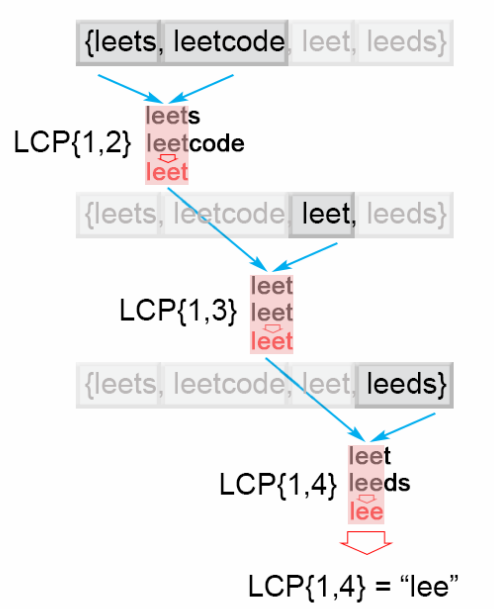

# Description
>Write a function to find the longest common prefix string amongst an array of strings.

If there is no common prefix, return an empty string "".

Example 1:
```py
Input: ["flower","flow","flight"]
Output: "fl"
```
Example 2:
```py
Input: ["dog","racecar","car"]
Output: ""
Explanation: There is no common prefix among the input strings.
```
Note: All given inputs are in lowercase letters a-z.

# Solution

## Approach 1. Horizontal scanning
1. 取出陣列中第一個字串當成prefix
2. 將prefix string與第二個字串中的字元一一比對，取出最大相同前綴e.g. prefix=leetcode S<sub>1</sub>=leetnode 兩者最大共同前綴=leet
3. 將prefix string更新為步驟2.中找到的最大相同前綴
4. 重複步驟2.、步驟3.直到strs陣列迭代結束



```py
class Solution:
    def longestCommonPrefix(self, strs: List[str]) -> str:
        prefix = strs[0] if strs else ''        
        for s in strs:
            for i in range(1, len(prefix)+1):
                if  s[:i] != prefix[:i]:
                    prefix = prefix[:i-1]
        return prefix
```


### Complexity Analysis
> - 最差的情況: 如果陣列中第一個元素，也就是我們的preifx string是個很長的字串，而陣列是一個很短的字串 e.g. ['aaaaaaaaaa', 'aaaaaaaaaa', 'aaaaaaaaaa', 'a']
Time complexity : *O(S)* , where *S* is the sum of all characters in all strings.

In the worst case all n strings are the same. The algorithm compares the string *S<sub>1</sub>* with the other strings [*S<sub>2</sub>...S<sub>n</sub>*] There are *S* character comparisons, where *S* is the sum of all characters in the input array.

Space complexity : *O(1)*. We only used constant extra space.

## Approach 2: Vertical scanning
>思考一下，如果有一個很短的字串在陣列的最後，上面的方法1.一樣會做*S*(所有字串的字元總和)次的字串比對，優化這個情況的情中一種方法就是Vertical scanning，我們先比對所有陣列中每個字串的第一個字元，再依序往後比對字串的下個字元，直到比對完陣列中第一個元素，也就是我們的prefix string迭代結束或直到strs陣列迭代結束。 **可以發現，同樣是迭代prefix與strs的雙層for迴圈，但Approch 1 與 Approch 2 兩個方法卻有著不同的效率，雖然在最差的情況下兩者個時間複雜度都是*O(S)***

```py
class Solution:
    def longestCommonPrefix(self, strs: List[str]) -> str:
        prefix = strs[0] if strs else ''  
        for i in range(1, len(prefix)+1):
            for s in strs:
                if prefix[:i] != s[:i]:
                    return prefix[:i-1]

        return prefix
        
```

Complexity Analysis

Time complexity : *O(S)* , where *S* is the sum of all characters in all strings. In the worst case there will be *n* equal strings with length *m* and the algorithm performs *S = m* ， *S = m ⋅ n* character comparisons. Even though the worst case is still the same as Approach 1, in the best case there are at most *n* ， *minLenn ⋅ minLen* comparisons where minLenminLen is the length of the shortest string in the array.
Space complexity : *O(1)*. We only used constant extra space.


